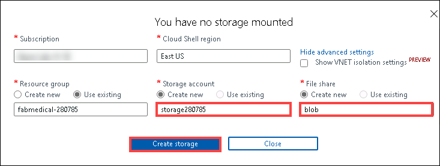

## Before the hands-on lab

**Duration**: 60 minutes

You should follow all of the steps provided in this section _before_ taking part in the hands-on lab ahead of time as some of these steps take time.

### Task 1: Setup Azure Cloud Shell

1.  In a web browser, navigate to https:<span></span>//shell.azure.com. Alternatively, from the Azure web portal, launch the **Azure Cloud Shell**. It has common Azure tools preinstalled and configured to use with your account. Login with following Azure credentials
     * Azure Usename/Email: <inject key="AzureAdUserEmail"></inject>
     * Azure Password: <inject key="AzureAdUserPassword"></inject>

   

2. The cloud shell opens in the browser window. Choose **Bash** if prompted or use the left-hand dropdown on the shell menu bar to choose **Bash** from the dropdown (as shown). If prompted, select **Confirm**.

   

3. You should make sure to set your default subscription correctly. To view your current subscription type:

   ```bash
   az account show
   ```

   

4. To set your default subscription to something other than the current selection, type the following, replacing {id} with the desired subscription id value:

   ```bash
   az account set --subscription {id}
   ```

> **Note**: To list all of your subscriptions, type:

   ```bash
   az account list
   ```

   

### Task 2: Download Starter Files

In this task, you use `git` to copy the lab content to your cloud shell so that the lab starter files will be available.

> **Note**: If you don't have a cloud shell available, refer back to [Task 1: Setup Azure Cloud Shell](#task-1-setup-azure-cloud-shell).

1. Type the following command and press `<ENTER>`:

   ```bash
   git clone https://github.com/microsoft/MCW-Cloud-native-applications.git
   ```

   > **Note**: If you do not have enough free space, you may need to remove extra files from your cloud shell environment.  Try running `azcopy jobs clean` to remove any `azcopy` jobs and data you do not need.

2. The lab files download.

   

3. We do not need the `.git` folder, and later steps will be less complex if we remove it. Run this command:

   ```bash
   rm -rf MCW-Cloud-native-applications/.git
   ```

