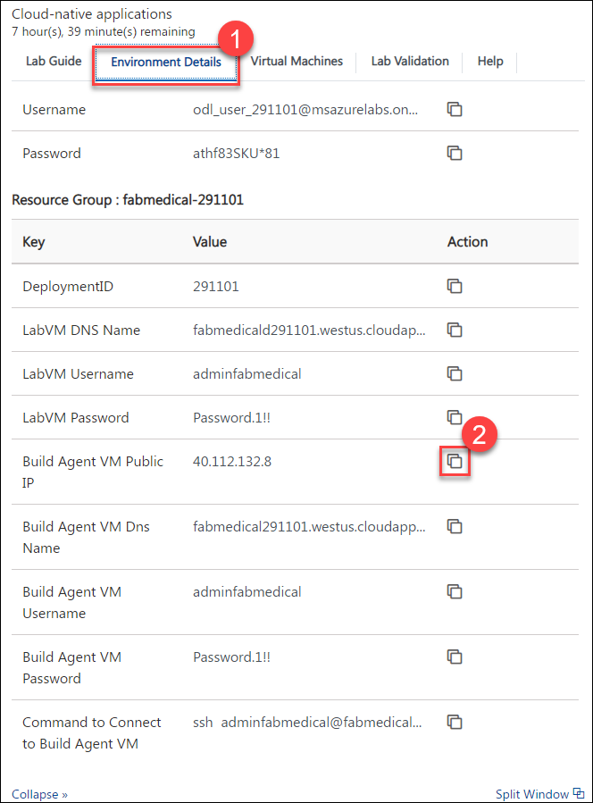
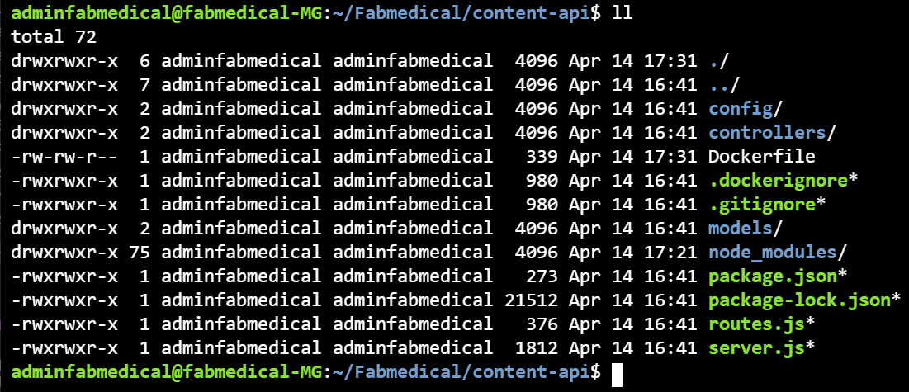
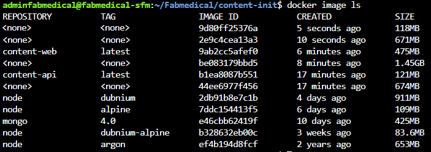
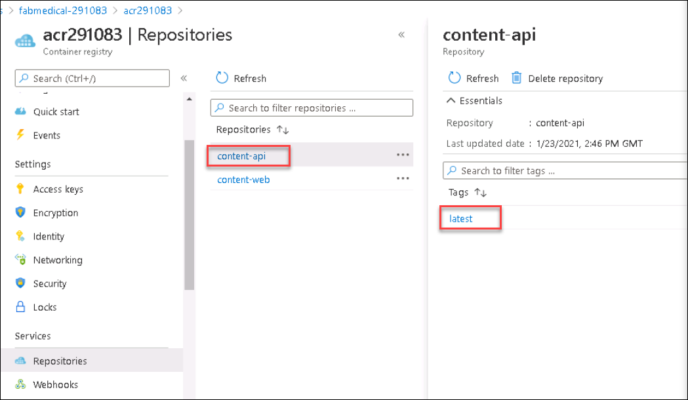

# Exercise 1: Create and run a Docker application

**Duration**: 40 minutes

In this exercise, you will take the starter files and run the node.js application as a Docker application. You will create a Dockerfile, build Docker images, and run containers to execute the application.

## Task 1: Test the application

The purpose of this task is to make sure you can run the application successfully before applying changes to run it as a Docker application.

1. Switch to the Git Bash Shell window, (If you have closed it and need to reconnect, please review the instructions on previous page i.e. "Before the HOL" page.)

1. Type the following command to create a Docker network named `fabmedical`, launch an instance of the mongo db container to use for local testing and confirm that it is running and ready:

   ```bash
   docker network create fabmedical

   docker container run --name mongo --net fabmedical -p 27017:27017 -d mongo:4.0

   docker container list
   docker container logs mongo
   
   ```

   

1. Next, we will initialize the local database with test content, first navigate to the content-init directory and run npm install.

      ```bash
      cd ~/Fabmedical/content-init
      npm install
      nodejs server.js

      ```
  
   

   

1. Confirm that the database now contains test data.

   ```bash
   mongo
   show dbs
   use contentdb
   show collections
   db.speakers.find()
   db.sessions.find()
   quit()
   
   ```

   This should produce output similar to the following:

   

1. Now navigate to the `content-api` directory,  run npm install and Start the API as a background process. Press `ENTER` again to get to a command prompt for the next step.
.

   ```bash
   cd ../content-api
   npm install
   nodejs ./server.js &
   ```

    

1. Test the API using curl. You will request the speaker's content, and this will return a JSON result.

    ```bash
    curl http://localhost:3001/speakers
    curl http://localhost:3001/sessions
    ```

    

1. Navigate to the web application directory, run `npm install` and `ng build`.

    ```bash
    cd ../content-web
    npm install
    ng build
    
    ```

    

1. You will need the **build agent vm** public IP address, which you can get from **Environment Details** tab.

      

1. From the bash console, we will use the sed command to  edit the `app.js` file and verify it. replace `<AGENT VM IP>` with the IP address copied in the previous step. We will also run the content-web application in the background.

   ```bash
   sed -i 's/localhost:/<AGENT VM IP>:/' app.js
   ```

   ```bash
   head app.js
   node ./app.js &
   ```

   

   Press `ENTER` again to get a command prompt for the next step.

1. Test the web application using curl. You will see HTML output returned without errors.

    ```bash
    curl http://localhost:3000
    ```

    

   > **Note**:  If you get no such file or directory error, run the below command and retry the command /n
   "ng Build"

## Task 2: Browsing to the web application

In this task, you will browse to the web application for testing.

1. Test the web application from a browser. Navigate to the web application using your build agent IP address at port `3000`. Get the Build Agent VM Ip from **Environment Details** tab.

   ```bash
   http://[BUILDAGENTVMIP]:3000
   ```

   > EXAMPLE: ```http://13.68.113.176:3000```

   

1. Select the Speakers and Sessions links in the header. You will see the pages display the HTML version of the JSON content you curled previously.

   

1. Once you have verified the application is accessible through a browser, go to your Git Bash window and stop the running node processes.

   ```bash
   killall -9 nodejs
   killall -9 node
   
   ```

## Task 3: Download a Dockerfile

In this task, you will create a new Dockerfile that will be used to run the API application as a containerized application.

> **Note**: You will be working in a Linux VM without friendly editor tools. You must follow the steps very carefully to work with Vim for a few editing exercises if you are not already familiar with Vim.

1. From the Bash window, navigate to the `content-api` folder. Download a file named `Dockerfile` and verify it is downloaded by listing the contents of the folder 

   ```bash
   cd ~/Fabmedical/content-api
   wget http://bit.ly/hol-Dockerfile -O Dockerfile
   ll
   
   ```

   

1. Review the `Dockerfile` content.

   ```bash
   cat Dockerfile
   ```

   > Content should be similar to following:

   ```shell
   FROM node:alpine AS base
   RUN apk -U add curl
   WORKDIR /usr/src/app
   EXPOSE 3001

   FROM node:argon AS build
   WORKDIR /usr/src/app

   # Install app dependencies
   COPY package.json /usr/src/app/
   RUN npm install

   # Bundle app source
   COPY . /usr/src/app

   FROM base AS final
   WORKDIR /usr/src/app
   COPY --from=build /usr/src/app .
   CMD [ "npm", "start" ]
   ```

1. This Dockerfile describes the following:

   - The base stage includes environment setup which we expect to change very rarely, if at all.

     - Creates a new Docker image from the base image node:alpine. This base image has node.js on it and is optimized for small size.

     - Add `curl` to the base image to support Docker health checks.

     - Creates a directory on the image where the application files can be copied.

     - Exposes application port `3001` to the container environment so that the application can be reached at port `3001`.

   - The build stage contains all the tools and intermediate files needed to create the application.

     - Creates a new Docker image from `node:argon`.

     - Creates a directory on the image where the application files can be copied.

     - Copies `package.json` to the working directory.

     - Runs npm install to initialize the node application environment.

     - Copies the source files for the application over to the image.

   - The final stage combines the base image with the build output from the build stage.

     - Sets the working directory to the application file location.

     - Copies the app files from the build stage.

     - Indicates the command to start the node application when the container is run.

## Task 4: Create Docker images

In this task, you will create Docker images for the application --- one for the API application and another for the web application. Each image will be created via Docker commands that rely on a Dockerfile.

1. In the Git Bash window connected to the build agent VM, type the following command to view any Docker images on the VM. The list will only contain the mongodb image downloaded earlier.

   ```bash
   docker image ls
   ```

   

1. From the content-api folder containing the API application files and the new Dockerfile you created, type the following command to create a Docker image for the API application. This command does the following:

   - Executes the Docker build command to produce the image

   - Tags the resulting image with the name `content-api` (-t)

   - The final dot (`.`) indicates to use the Dockerfile in this current directory context. By default, this file is expected to have the name `Dockerfile` (case sensitive).

   ```bash
   docker image build -t content-api .
   ```

   

1. Once the image is successfully built, run the Docker images listing command again. You will see several new images: the node images and your container image.

   ```bash
   docker image ls
   ```

   Notice the untagged image. This is the build stage which contains all the intermediate files not needed in your final image.

   

1. Commit and push the new Dockerfile before continuing.

   ```bash
   git add .
   git commit -m "Added Dockerfile"
   git push
   ```

   Enter credentials if prompted.

1. Navigate to the content-web folder again and list the files. Note that this folder already has a Dockerfile. View the Dockerfile contents -- which are similar to the file you created previously in the API folder

   ```bash
   cd ../content-web
   ll
   cat Dockerfile
   ```

   > Notice that the `content-web` Dockerfile build stage includes additional tools for a front-end Angular application in addition to installing npm packages.

1. Type the following command to create a Docker image for the web application.

   ```bash
   docker image build -t content-web .
   docker image ls
   ```

   

## Task 5: Configure and run the **api** container

The web application container will be calling endpoints exposed by the API application container and the API application container will be communicating with mongodb. In this exercise, you will launch the images you created as containers on the same bridge network you created when starting mongodb.

1. We need to create and start the API application container with the **docker container run** command. The command given below does the following:

   - Names the container `api` for later reference with Docker commands.

   - Instructs the Docker engine to use the `fabmedical` network.

   - Instructs the Docker engine to use port `3001` and map that to the internal container port `3001`.

   - Creates a container from the specified image, by its tag, such as `content-api`.

   - Instructs the Docker engine to set the environment variable by adding the `-e` switch. This is required as without it the `docker container run` command will fail. This is because the image is configured to connect to mongodb using a localhost URL and since it is isolated in a separate container, it cannot access mongodb via localhost even when running on the same docker host. Instead, the API must use the bridge network to connect to mongodb

   - Use the `-d` switch to run the api as a daemon.

   ```bash
   docker container run --name api --net fabmedical -p 3001:3001 -e MONGODB_CONNECTION=mongodb://mongo:27017/contentdb -d content-api
   ```

   

1. Enter the command to show running containers. You will observe that the `api` container is in the list. Use the docker logs command to see that the API application has connected to mongodb.

   ```bash
   docker container ls
   docker container logs api

   ```

   

1. Test the API by curling the URL. You will see JSON output as you did when testing previously.

   ```bash
   curl http://localhost:3001/speakers
   curl http://localhost:3001/sessions
   ```

## Task 6: Configure and run the **web** container

In this task, you will configure the `web` container to communicate with the API container using an environment variable, similar to the way the mongodb connection string is provided to the api.

1. From Bash window if we switch to the **content-web** folder and review the `app.js` file, we can observe the highlighted line declaring the **contentApiUrl**  variable, which can be set with an environment variable directive.

   ```bash
   cd ../content-web
   cat app.js
   
   ```
  
   
  
1. Review the Dockerfile.

   ```bash
   cat Dockerfile
   ```

1. To set the environment variable, you will need to inject the below line above the `EXPOSE` line shown above.

   ```Dockerfile
   ENV CONTENT_API_URL http://localhost:3001
   ```

1. The below command will inject the above environment variable directive just above 'EXPOSE 3000' line.

   ```bash
   sed -i "s,EXPOSE 3000,ENV CONTENT_API_URL http://localhost:3001\nEXPOSE 3000,g" Dockerfile
   cat Dockerfile
   ```

    

1. Build the web application Docker image using the same command as you did previously. Once done, create and start the image passing the correct URI to the API container as an environment variable. This variable will address the API application using its container name over the Docker network you created. After running the container, check to see the container is running and note the dynamic port assignment for the next step. Since the VM only exposes a limited port range we wil be using using port `3000` using the **-p** switch, on the run command, to test in the browser

   ```bash
   docker image build -t content-web .
   docker container run --name web --net fabmedical -p 3000:3000 -d -e CONTENT_API_URL=http://api:3001 content-web
   docker container ls
   ```

   

1. You can now use a web browser to navigate to the website and successfully view the application at port `3000`. Replace `[BUILDAGENTIP]` with the **IP address** you used previously.

    ```bash
    http://[BUILDAGENTIP]:3000
    ```

    >EXAMPLE: http://13.68.113.176:3000

1. Commit your changes and push to the repository, using the commands below. Enter credentials if prompted.

    ```bash
    git add .
    git commit -m "Setup Environment Variables"
    git push
    ```

## Task 7: Push images to Azure Container Registry

To run containers in a remote environment, you will typically push images to a Docker registry, where you can store and distribute images. Each service will have a repository that can be pushed to and pulled from with Docker commands. Azure Container Registry (ACR) is a managed private Docker registry service based on Docker Registry v2.

In this task, you will push images to your ACR account, version images with tagging, and setup continuous integration (CI) to build future versions of your containers and push them to ACR automatically.

1. In the Azure Portal `(https://portal.azure.com/)`, under navigate select **Resource groups** and click on **fabmedical-{DeploymentID}** resource group. Next, in the resource group page select Azure container registry

   

   

1. Select **Access keys** under **Settings** on the left-hand menu.

   

1. The Access keys blade displays the Login server, username, and password that will be required for the next step. Make note of this values, you will be using it in the next part of lab

   > **Note**: If the username and password do not appear, select Enable on the Admin user option.

   

1. From the Git Bash window connected to your build VM, login to your ACR account by typing the following command. Follow the instructions to complete the login.

   ```bash
   docker login [LOGINSERVER] -u [USERNAME] -p [PASSWORD]
   ```

   >For example:
   docker login acr289069.azurecr.io -u acr289069 -p +W/j=l+Fcze=n07SchxvGSlvsLRh/7ga

   

   > **Tip**: Make sure to specify the fully qualified registry login server (all lowercase).

1. Run the following commands to properly tag your images to match your ACR account name. List your docker images and look at the repository and tag. Note that the repository is prefixed with your ACR login server name, such as the sample shown in the screenshot below

    > **Note**: Be sure to replace `[LOGINSERVER]` of your ACR instance.

   ```bash
   docker image tag content-web [LOGINSERVER]/content-web
   ```

   ```bash
   docker image tag content-api [LOGINSERVER]/content-api
   ```

   ```bash
   docker image ls
   ```

   

1. Push the images to your ACR account with the following command:

   ```bash
   docker image push [LOGINSERVER]/content-web
   ```

   ```bash
   docker image push [LOGINSERVER]/content-api
   ```

   ![In this screenshot of the console window, an example of images being pushed to an ACR account results from typing and running the following at the command prompt: docker push [LOGINSERVER]/content-web.](media/image67.png "Push image to ACR")

1. In the Azure Portal, navigate to your ACR account, and select **Repositories** under **Services** on the left-hand menu. You will now see two, one for each image.

   

## [Optional] Task 8: Tag container Images

 > **Note**: If time permits, attempt this section of the task otherwise move to the next one.

In this task, you will use features within azure registry to tag and version deployed images.

1. Within the Azure Container registry's repository view, select `content-api`. You will see the latest tag is assigned.

   

1. From the Git Bash session attached to the VM, assign the `v1` tag to each image with the following commands. Then list the Docker images to note that there are now two entries for each image: showing the `latest` tag and the `v1` tag. Also note that the image ID is the same for the two entries, as there is only one copy of the image.

    ```bash
    docker image tag [LOGINSERVER]/content-web:latest [LOGINSERVER]/content-web:v1
    ```

    ```bash
    docker image tag [LOGINSERVER]/content-api:latest [LOGINSERVER]/content-api:v1
    ```

    ```bash
    docker image ls
    ```

    

1. Push the images to your ACR account with the following command:

    ```bash
    docker image push [LOGINSERVER]/content-web:v1
    ```

    ```bash
    docker image push [LOGINSERVER]/content-api:v1
    ```

1. Refresh one of the repositories to see the two versions of the image now appear.

    

1. Run the following commands to pull an image from the repository. Note that the default behavior is to pull images tagged with `:latest`. You can pull a specific version using the version tag. Also, note that since the images already exist on the build agent, nothing is downloaded.

    ```bash
    docker image pull [LOGINSERVER]/content-web
    ```

    ```bash
    docker image pull [LOGINSERVER]/content-web:v1
    ```

## [Optional] Task 9: Setup CI Pipeline to Push Images

 > **Note**: If time permits, attempt this section of the task otherwise move to the next exercise.

In this task, you will use YAML to define a GitHub Actions workflow that builds your Docker
image and pushes it to your ACR instance automatically.

1. In GitHub, return to the **Fabmedical** repository screen, and select the **Settings** tab.

1. From the left menu, select **Secrets**.

1. Select the **New repository secret** button.

    

1. In the **New secret** form, enter the name `ACR_USERNAME` and for the value, paste in the Azure Container Registry **Username** that was copied previously. Select **Add secret**.

    

1. Add another Secret, by entering the name `ACR_PASSWORD` and for the value, paste in the Azure Container Registry **Password** that was copied previously.

    

1. In your Git Bash session connected to the build agent VM, navigate to the `~/Fabmedical` directory:

   ```bash
   cd ~/Fabmedical
   ```

1. Before the GitHub Actions workflows can be setup, the `.github/workflows` directory needs to be created again and download workflow yml files. Do this by running the following commands:

    ```bash
    rm -rf ~/Fabmedical/.github/workflows/
    mkdir ~/Fabmedical/.github/workflows/
    cd ~/Fabmedical/.github/workflows/
    wget http://bit.ly/hol-content-web -O content-web.yml
    wget http://bit.ly/hol-content-api -O content-api.yml
    
    ```

1. Next run the sed command to update the workflow YAML file with the correct DeploymentID. replace `<SUFFIX>` above with your DeploymentID value given on Environment details page

    ```bash
    sed 's/\[DeploymentID\]/<SUFFIX>/g' content-web.yml
    cat content-web.yml
    ```

    Text to be replaced

      ```view
      # Environment variables are defined so that they can be used throughout the job definitions.
      env:
      imageRepository: 'content-web'
      resourceGroupName: 'fabmedical-[DeploymentID]'
      containerRegistryName: 'acr[DeploymentID]'
      containerRegistry: 'acr[DeploymentID].azurecr.io'
      dockerfilePath: './content-web'
      tag: '${{ github.run_id  }}'
      ```

    The contents of the file should  look like the illustration highlighted below

    

1. Save the pipeline YAML, then commit and push it to the Git repository:

    ```bash
    git add .
    git commit -m "Added workflow YAML"
    git push
    ```

1. In GitHub, return to the **Fabmedical** repository screen, and select the **Actions** tab.

1. On the **Actions** page, select the **content-web** workflow.

1. On the **content-web** workflow, select **Run workflow** and manually trigger the workflow to execute.

    

1. After a second, the newly triggered workflow execution will display in the list. Select the new **content-web** execution to view its status.

1. Selecting the **Build and Push Docker Image** job of the workflow will display its execution status.

    

1. Next, setup the `content-api` workflow. Update the `resourceGroupName` using the `sed` command below and replacing the `<SUFFIX>` with your ```DeploymentID``` value from ```Environment Details``` tab.

    ```bash
    cd ~/Fabmedical/.github/workflows
    sed 's/\[DeploymentID\]/<SUFFIX>/g' content-api.yml
    cat content-api.yml
    ```

    The updated file fragment should look like as show below
    

1. Save the file, then commit and push it to the Git repository:

    ```bash
    git add .
    git commit -m "Updated workflow YAML"
    git push
    ```

1. Next, navigate to the repositories in GitHub, select Actions, and then manually run the content-api workflow.
