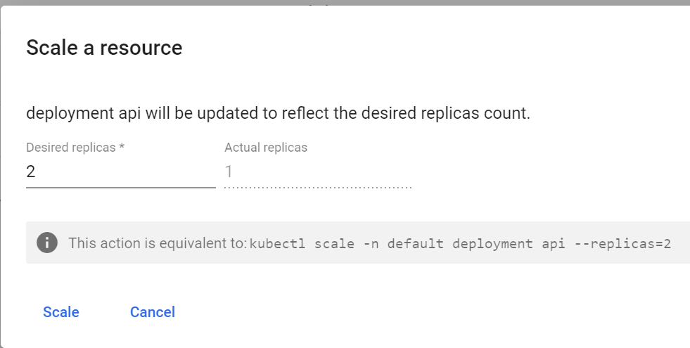
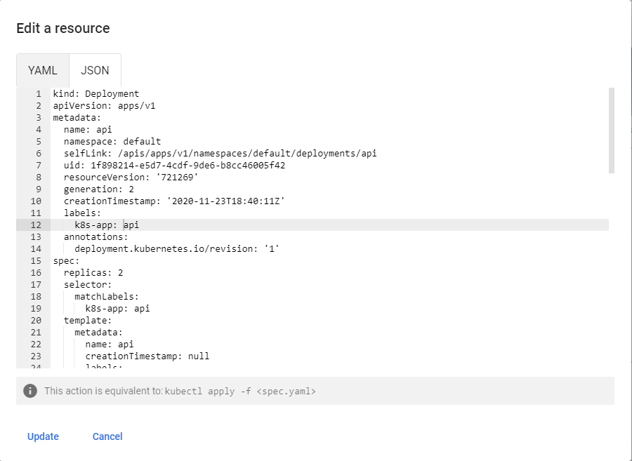
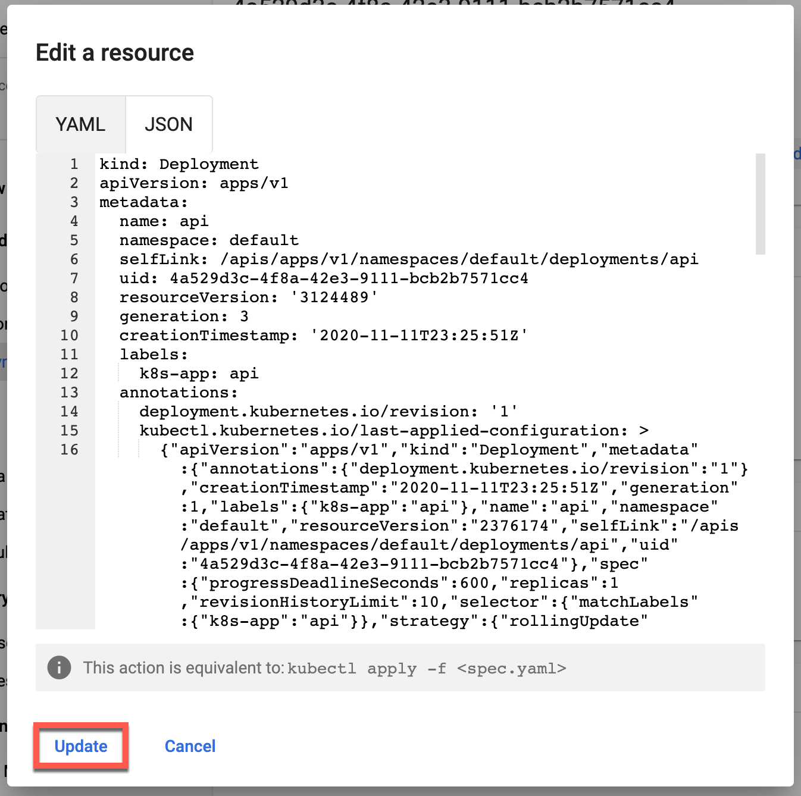
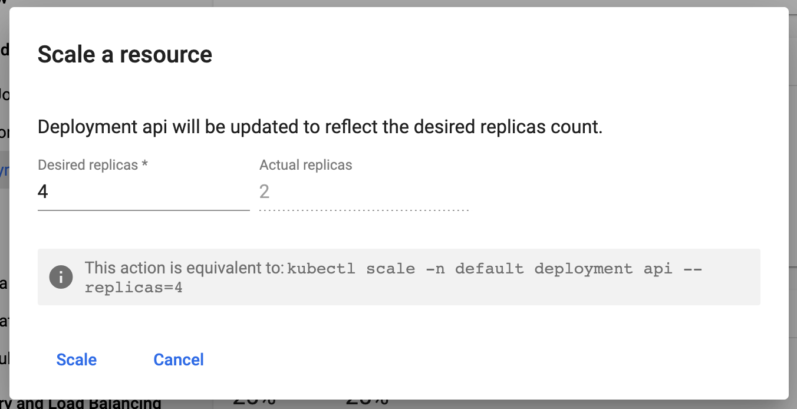
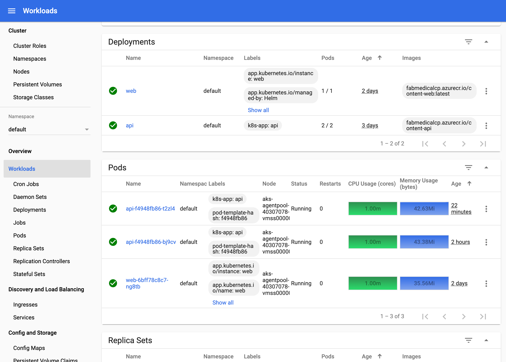
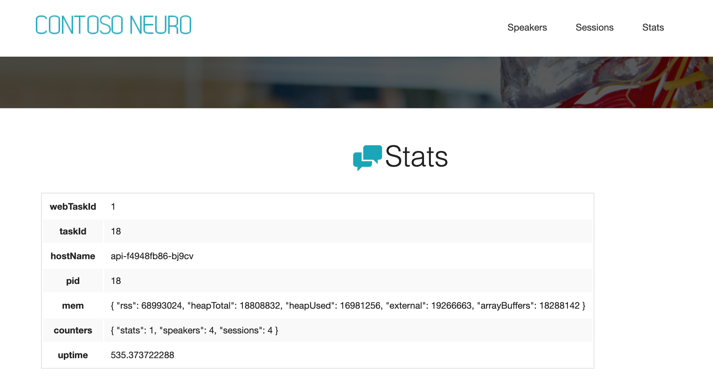
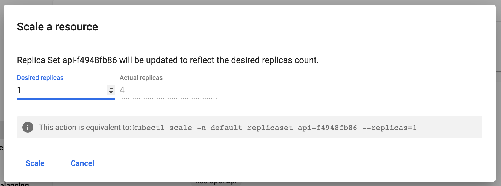
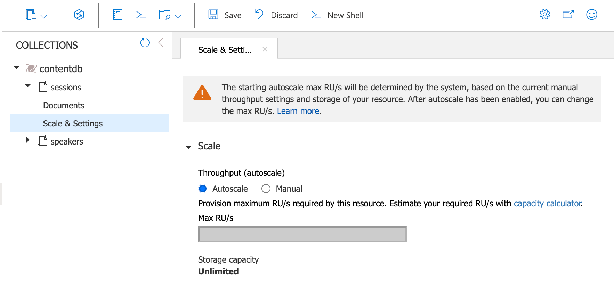

# Exercise 4: Scale the application and test HA

**Duration**: 20 minutes

At this point, you have deployed a single instance of the web and API service containers. In this exercise, you will increase the number of container instances for the web service and scale the front-end on the existing cluster.

## Task 1: Increase service instances from the Kubernetes dashboard

In this task, you will increase the number of instances for the API deployment in the Kubernetes management dashboard. While it is deploying, you will observe the changing status.

1. Switch to the Kubernetes Dashboard.

2. From the navigation menu, select **Workloads** -\> **Deployments**, and then select the **API** deployment.

3. Select the vertical ellipses and then select **Edit**.

   

4. In the Edit a resource dialog, select the YAML tab. You will see a list of settings shown in YAML format.

5. Scroll down about halfway to find the cpu and update the value of cpu to 500m, as shown in the screenshot below. When done click on update.

   

6. From the API deployment view, select the **SCALE** button.

   

7. Change the number of replicas to **2**, and then select **Scale**.

   

   > **Note**: If the deployment completes quickly, you may not see the deployment Waiting states in the dashboard, as described in the following steps.

8. From the Replica Set view for the API, you will see it is now deploying and that there is one healthy instance and one pending instance.

   

9. From the navigation menu, select **Deployments** from the list. Note that the api service has a pending status indicated by the grey timer icon, and it shows a pod count 1 of 2 instances (shown as `1/2`).

   

10. From the Navigation menu, select **Workloads**. From this view, note that the health overview in the right panel of this view. You will see the following:

   - One deployment and one replica set are each healthy for the api service.

   - One replica set is healthy for the web service.

   - Three pods are healthy.

11. Navigate to the web application from the browser again. The application should still work without errors as you navigate to Speakers and Sessions pages.

   - Navigate to the `/stats` page. You will see information about the environment including:

     - **webTaskId:** The task identifier for the web service instance.

     - **taskId:** The task identifier for the API service instance.

     - **hostName:** The hostname identifier for the API service instance.

     - **pid:** The process id for the API service instance.

     - **mem:** Some memory indicators returned from the API service instance.

     - **counters:** Counters for the service itself, as returned by the API service instance.

     - **uptime:** The up time for the API service.

   - Refresh the page in the browser, and you can see the hostName change between the two API service instances. The letters after `api-{number}-` in the hostname will change.

## Task 2: Increase service instances beyond available resources

In this task, you will try to increase the number of instances for the API service container beyond available resources in the cluster. You will observe how Kubernetes handles this condition and correct the problem.

1. From the navigation menu, select **Deployments**. From this view, select the **api** deployment.

2. Configure the deployment to use a fixed host port for initial testing. Select the vertical ellipses and then select **Edit**.

3. In the Edit a resource dialog, select the YAML tab. You will see a list of settings shown in YAML format. Use the copy button to copy the text to your clipboard.

   

4. Paste the contents into the text editor of your choice (such as Notepad on Windows, macOS users can use TextEdit).

5. Scroll down about halfway to find the node `$.spec.template.spec.containers[0]`, as shown in the screenshot below.

   ![Screenshot of the deployment code, with the $.spec.template.spec.containers[0] section highlighted.](media/image84.png "Container deployment configuration")

6. The containers spec has a single entry for the API container at the moment. You will see that the name of the container is `api` - this is how you know you are looking at the correct container spec.

   - Add the following snippet below the `name` property in the container spec:

   ```text
     ports:
	    containerPort: 3001
	    hostPort: 3001
   ```

   - Your container spec should now look like this:

   ![Screenshot of the deployment JSON code, with the $.spec.template.spec.containers[0] section highlighted, showing the updated values for containerPort and hostPort, both set to port 3001.](media/image85.png "View container ports")

7. Copy the updated document from notepad into the clipboard. Return to the Kubernetes dashboard, which should still be viewing the **api** deployment.

   - Paste the updated document.

   - Select Update.

   

8. From the API deployment view, select **Scale**.

9. Change the number of replicas to 4 and select **Scale**.

   

10. From the navigation menu, select **Services** view under **Discovery and Load Balancing**. Select the **api** service from the **Services** list. From the api service view, you will see it has two healthy instances and one or two unhealthy (or possibly pending depending on timing) instances.

    

11. After a few minutes, select **Workloads** from the navigation menu. From this view, you should see an alert reported for the api deployment.

    

    > **Note**: This message indicates that there were not enough available resources to match the requirements for a new pod instance. In this case, this is because the instance requires port `3001`, and since there are only 2 nodes available in the cluster, only two api instances can be scheduled. The third or fourth pod instances will wait for a new node to be available that can run another instance using that port.

12. Reduce the number of requested pods to `2` using the **Scale** button.

13. Almost immediately, the warning message from the **Workloads** dashboard should disappear, and the **API** deployment will show `2/2` pods are running.

    

## Task 3: Restart containers and test HA

In this task, you will restart containers and validate that the restart does not impact the running service.

1. From the navigation menu on the left, select **Services** view under **Discovery and Load Balancing**. From the **Services** list, select the external endpoint hyperlink for the web service, and visit the **Stats** page by adding / stats to the URL. Keep this open and handy to be refreshed as you complete the steps that follow.

   

   

2. From the navigation menu, select **Workloads** -> **Deployments**. From Deployments list, select the **API** deployment.

   

3. From the API deployment view, select **Scale** and from the dialog presented, and enter `4` for the desired number of pods. Select **OK**.

4. From the navigation menu, select **Workloads** -> **Replica Sets**. Select the **api** replica set, and from the **Replica Set** view, you will see that one or two pods cannot deploy.

   

5. Return to the browser tab with the web application stats page loaded. Refresh the page over and over. You will not see any errors, but you will see the api host name change between the two api pod instances periodically. The task id and pid might also change between the two api pod instances.

   

6. After refreshing enough times to see that the `hostName` value is changing, and the service remains healthy, return to the **Replica Sets** view for the API. From the navigation menu, select Replica Sets under Workloads and select the **API** replica set.

7. From this view, take note that the hostName value shown in the web application stats page matches the pod names for the pods that are running.

   

8. Note the remaining pods are still pending, since there are not enough port resources available to launch another instance. Make some room by deleting a running instance. Select the context menu and choose **Delete** for one of the healthy pods.

   

9. Once the running instance is gone, Kubernetes will be able to launch one of the pending instances. However, because you set the desired size of the deploy to 4, Kubernetes will add a new pending instance. Removing a running instance allowed a pending instance to start, but in the end, the number of pending and running instances is unchanged.

   

10. From the navigation menu, select **Deployments** under **Workloads**. From the view's Deployments list, select the **API** deployment.

11. From the API Deployment view, select Scale and enter `1` as the desired number of pods. Select **OK**.

    

12. Return to the web site's stats page in the browser and refresh while this is scaling down. You will notice that only one API host name shows up, even though you may still see several running pods in the API replica set view. Even though several pods are running, Kubernetes will no longer send traffic to the pods it has selected to scale down. In a few moments, only one pod will show in the API replica set view.

    

13. From the navigation menu, select **Workloads**. From this view, note that there is only one API pod now.

    

## Task 4: Configure Cosmos DB Autoscale

In this task, you will setup Autoscale on Azure Cosmos DB.

1. In the Azure Portal, navigate to the `fabmedical-[SUFFIX]` **Azure Cosmos DB Account**.

2. From the left hand-menu select **Data Explorer**. 

3. Within **Data Explorer**, expand the `contentdb` database, then expand the `sessions` collection.

4. Under the `sessions` collection, select **Scale & Settings**.

5. On the **Scale & Settings**, select **Autoscale** for the **Throughput** setting under **Scale**.

    

6. Select **Save**.

7. Perform the same task to enable **Autoscale** Throughput on the `speakers` collection.

## Task 5: Test Cosmos DB Autoscale

In this task, you will run a performance test script that will test the Autoscale feature of Azure Cosmos DB so you can see that it will now scale greater than 400 RU/s.

1. In the Azure Portal, navigate to the `fabmedical-[SUFFIX]` **Cosmos DB account**.

2. Select **Connection String** under **Settings**.

3. On the **Connection String** pane, copy the **HOST**, **USERNAME**, and **PRIMARY PASSWORD** values. Save these for use later.

    

4. Return to the SSH window which has the  **SSH session** to the **Build agent VM**.

5. Navigate to the `~/Fabmedical` directory.

    ```bash
    cd ~/Fabmedical
    ```

6. Run the following command to open the `perftest.sh` script for editing in Vi.

    ```bash
    vi perftest.sh
    ```

7. There are several variables declared at the top of the `perftest.sh` script. Modify the **host**, **username**, and **password** variables by setting their values to the corresponding Cosmos DB Connection String values that were copied previously.

    

8. Press the Escape key and type :wq and then press the Enter key to save and close the file.

9. Run the following command to execute the `perftest.sh` script to run a small load test against Cosmos DB. This script will consume RU's in Cosmos DB by inserting many documents into the Sessions container.

    ```bash
    bash ./perftest.sh
    ```

    > **Note:** The script will take a minute to complete executing. If it takes more then 2 mins press ctrl+c to close current process.

10. Once the script has completed, navigate back to the **Cosmos DB account** in the Azure portal.

11. Scroll down on the **Overview** pane of the **Cosmos DB account** blade, and locate the **Request Charge** graph.

    > **Note:** It may take 2 - 5 minutes for the activity on the Cosmos DB collection to appear in the activity log. Wait a couple minutes and then refresh the pane if the recent Request charge doesn't show up right now.

12. Notice that the **Request charge** now shows there was activity on the **Cosmos DB account** that exceeded the 400 RU/s limit that was previously set before Autoscale was turned on.

    
