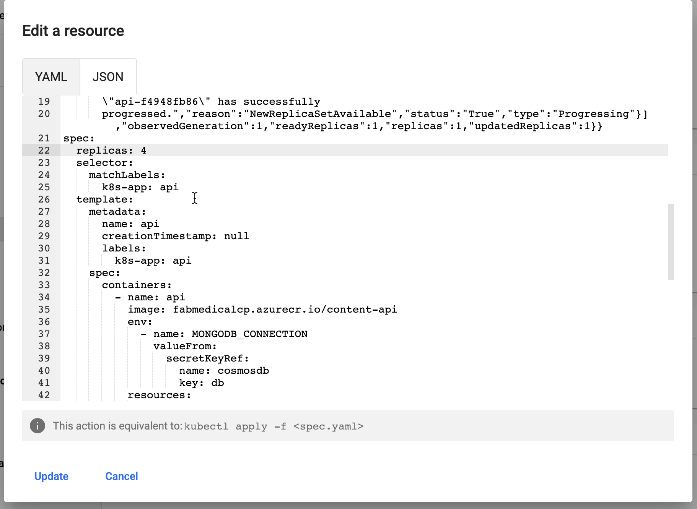
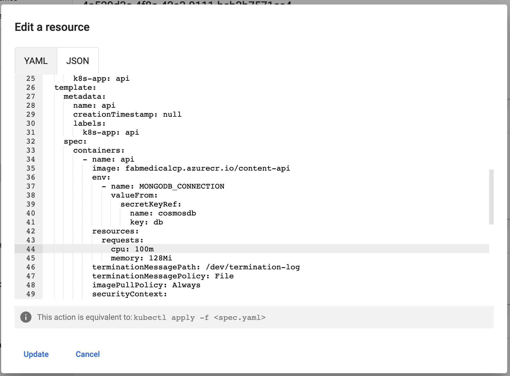
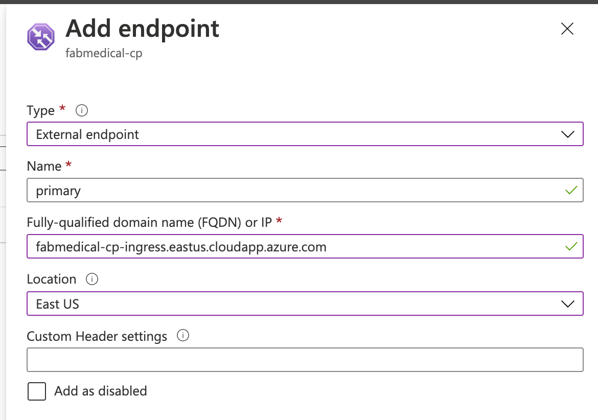

## Exercise 5: Working with services and routing application traffic

**Duration**: 1 hour

In the previous exercise, we introduced a restriction to the scale properties of the service. In this exercise, you will configure the api deployments to create pods that use dynamic port mappings to eliminate the port resource constraint during scale activities.

Kubernetes services can discover the ports assigned to each pod, allowing you to run multiple instances of the pod on the same agent node --- something that is not possible when you configure a specific static port (such as 3001 for the API service).

### Task 1: Scale a service without port constraints

In this task, we will reconfigure the API deployment so that it will produce pods that choose a dynamic hostPort for improved scalability.

1. From the navigation menu select **Deployments** under **Workloads**. From the view's Deployments list, select the **API** deployment.

2. Select **Edit**.

3. From the **Edit a Deployment** dialog, do the following:

   - Scroll to the first spec node that describes replicas as shown in the screenshot. Set the value for replicas to `4`.

   - Within the replicas spec, beneath the template node, find the **api** containers spec. Remove the `hostPort` entry for the API container's port mapping.  The screenshot below shows the desired configuration after editing.

   - Within the resources, beneath the template node, find the **cpu** under requests. Update this to `100m` so the **api** instances use less than a full CPU core.

     

     

4. Select **Update**. New pods will now choose a dynamic port.

5. The API service can now scale to 4 pods since it is no longer constrained to an instance per node and a full cpu core per instance -- a previous limitation while using port `3001`.

   

6. Return to the browser and refresh the stats page. You should see all 4 pods serve responses as you refresh.

### Task 2: Update an external service to support dynamic discovery with a load balancer

In this task, you will update the web service so that it supports dynamic discovery through the Azure load balancer.

1. From the navigation menu, select **Deployments** under **Workloads**. From the view's Deployments list, select the **web** deployment.

2. Select **Edit**, then select the **JSON** tab.

3. From the dialog, scroll to the web containers spec as shown in the screenshot. Remove the hostPort entry for the web container's port mapping.

   

4. Select **Update**.

5. From the **web** Deployments view, select **Scale**. From the dialog presented enter 4 as the desired number of pods and select **OK**.

6. Check the status of the scale out by refreshing the web deployment's view. From the navigation menu, select **Pods** from under Workloads. Select the **web** pods. From this view, you should see an error like that shown in the following screenshot.

   

Like the API deployment, the web deployment used a fixed _hostPort_, and your ability to scale was limited by the number of available agent nodes. However, after resolving this issue for the web service by removing the _hostPort_ setting, the web deployment is still unable to scale past two pods due to CPU constraints. The deployment is requesting more CPU than the web application needs, so you will fix this constraint in the next task.

### Task 3: Adjust CPU constraints to improve scale

In this task, you will modify the CPU requirements for the web service so that it can scale out to more instances.

1. From the navigation menu, select **Deployments** under **Workloads**. From the view's Deployments list, select the **web** deployment.

2. Select the vertical ellipses, then select **Edit**.

3. From the Edit a Deployment dialog, select the **JSON** tab, then find the **cpu** resource requirements for the web container. Change this value to `125m`

   

4. In the same **JSON** tab, find the **port** resource under readinessProbe and update it to 3000.

   

5. Select **Update** to save the changes and update the deployment.

6. From the navigation menu, select **Replica Sets** under **Workloads**. From the view's Replica Sets list select the web replica set.

7. When the deployment update completes, four web pods should be shown in running state.

   

8. Return to the browser tab with the web application loaded. Refresh the stats page at /stats to watch the display update to reflect the different api pods by observing the host name refresh.

### Task 4: Perform a rolling update

In this task, you will edit the web application source code to add Application Insights and update the Docker image used by the deployment. Then you will perform a rolling update to demonstrate how to deploy a code change.

1. Execute this command in Azure Cloud Shell to retrieve the instrumentation key for the `content-web` Application Insights resource:

   ```bash
   az resource show -g fabmedical-[SUFFIX] -n content-web --resource-type "Microsoft.Insights/components" --query properties.InstrumentationKey -o tsv
   ```

   Copy this value. You will use it later.

2. Update your starter files by pulling the latest changes from the Git repository:

   ```bash
   cd ~/clouddrive/MCW-Cloud-native-applications/Hands-on\ lab/lab-files/developer/content-web
   git pull
   ```

3. Install support for Application Insights.

   ```bash
   npm install applicationinsights --save
   ```

4. Open the `app.js` file:

   ```bash
   code app.js
   ```

5. Add the following lines immediately after `express` is instantiated on line 6:

   ```javascript
   const appInsights = require("applicationinsights");
   appInsights.setup("[YOUR APPINSIGHTS KEY]");
   appInsights.start();
   ```

   

6. Save changes and close the editor.

7. Push these changes to your repository so that GitHub Actions CI will build and deploy a new image.

   ```bash
   git add .
   git commit -m "Added Application Insights"
   git push
   ```

8. Visit the `content-web` workflow for your GitHub repository and see the new image being deployed into your Kubernetes cluster.

9. While this update runs, return the Kubernetes management dashboard in the browser.

10. From the navigation menu, select **Replica Sets** under **Workloads**. From this view, you will see a new replica set for the web, which may still be in the process of deploying (as shown below) or already fully deployed.

    

11. While the deployment is in progress, you can navigate to the web application and visit the stats page at `/stats`. Refresh the page as the rolling update executes. Observe that the service is running normally, and tasks continue to be load balanced.

    

### Task 5: Configure Kubernetes Ingress

In this task you will setup a Kubernetes Ingress to take advantage of path-based routing and TLS termination.

1. Within the Azure Cloud Shell, run the following command to add the Nginx stable Helm repository:

    ```bash
    helm repo add stable https://charts.helm.sh/stable
    ```

2. Update your helm package list.

   ```bash
   helm repo update
   ```

   > **Note**: If you get a "no repositories found." error, then run the following command. This will add back the official Helm "stable" repository.
   > ```
   > helm repo add nginx-stable https://helm.nginx.com/stable
   > ```

3. Install the ingress controller resource to handle ingress requests as they come in. The ingress controller will receive a public IP of its own on the Azure Load Balancer and be able to handle requests for multiple services over port 80 and 443.

   ```bash
   helm install nginx stable/nginx-ingress
   ```

4. From the Kubernetes dashboard, ensure the Namespace filter is set to **All namespaces**

5. Under **Discovery and Load Balancing**, select **Services**, then copy the IP Address for the **External endpoints** for the `nginx-ingress-RANDOM-controller` service.

   

    > **Note**: It could take a few minutes to refresh, alternately, you can find the IP using the following command in Azure Cloud Shell.
    >
    > ```bash
    > kubectl get svc --namespace kube-system
    > ```
    >
   

6. Within the Azure Cloud Shell, create a script to update the public DNS name for the IP.

   ```bash
   code update-ip.sh
   ```

   Paste the following as the contents and update the IP and SUFFIX values:

   ```bash
   #!/bin/bash

   # Public IP address
   IP="[INGRESS PUBLIC IP]"

   # Name to associate with public IP address
   DNSNAME="fabmedical-[SUFFIX]-ingress"

   # Get the resource-id of the public ip
   PUBLICIPID=$(az network public-ip list --query "[?ipAddress!=null]|[?contains(ipAddress, '$IP')].[id]" --output tsv)

   # Update public ip address with dns name
   az network public-ip update --ids $PUBLICIPID --dns-name $DNSNAME
   ```

   

   Be sure to replace the following placeholders in the script:

   - `[INGRESS PUBLIC IP]`: Replace this with the IP Address copied previously.
   - `[SUFFIX]`: Replace this with the same SUFFIX value used previously for this lab.

7. Save changes and close the editor.

8. Run the update script.

   ```bash
   bash ./update-ip.sh
   ```

9. Verify the IP update by visiting the URL in your browser.

   > **Note**: It is normal to receive a 404 message at this time.

   ```text
   http://fabmedical-[SUFFIX]-ingress.[AZURE-REGION].cloudapp.azure.com/
   ```

   

10. Use helm to install `cert-manager`, a tool that can provision SSL certificates automatically from letsencrypt.org.

    ```bash
    kubectl create namespace cert-manager

    kubectl label namespace cert-manager cert-manager.io/disable-validation=true

    kubectl apply --validate=false -f https://github.com/jetstack/cert-manager/releases/download/v1.0.1/cert-manager.yaml
    ```

11. Cert manager will need a custom ClusterIssuer resource to handle requesting SSL certificates.

    ```bash
    code clusterissuer.yml
    ```

    The following resource configuration should work as is:

    ```yaml
    apiVersion: cert-manager.io/v1
    kind: ClusterIssuer
    metadata:
      name: letsencrypt-prod
    spec:
      acme:
        # The ACME server URL
        server: https://acme-v02.api.letsencrypt.org/directory
        # Email address used for ACME registration
        email: user@fabmedical.com
        # Name of a secret used to store the ACME account private key
        privateKeySecretRef:
          name: letsencrypt-prod
        # Enable HTTP01 validations
        solvers:
        - http01:
            ingress:
              class: nginx
    ```

12. Save changes and close the editor.

13. Create the issuer using `kubectl`.

    ```bash
    kubectl create --save-config=true -f clusterissuer.yml
    ```

14. Now you can create a certificate object.

    > **Note**:
    >
    > Cert-manager might have already created a certificate object for you using ingress-shim.
    >
    > To verify that the certificate was created successfully, use the `kubectl describe certificate tls-secret` command.
    >
    > If a certificate is already available, skip to step 16.

    ```bash
    code certificate.yml
    ```

    Use the following as the contents and update the `[SUFFIX]` and `[AZURE-REGION]` to match your ingress DNS name

    ```yaml
    apiVersion: cert-manager.io/v1
    kind: Certificate
    metadata:
      name: tls-secret
    spec:
      secretName: tls-secret
      dnsNames:
        - fabmedical-[SUFFIX]-ingress.[AZURE-REGION].cloudapp.azure.com
      issuerRef:
        name: letsencrypt-prod
        kind: ClusterIssuer
    ```

15. Save changes and close the editor.

16. Create the certificate using `kubectl`.

    ```bash
    kubectl create --save-config=true -f certificate.yml
    ```

    > **Note**: To check the status of the certificate issuance, use the `kubectl describe certificate tls-secret` command and look for an _Events_ output similar to the following:
    >
    > ```text
    > Type    Reason         Age   From          Message
    > ----    ------         ----  ----          -------
    > Normal  Generated           38s   cert-manager  Generated new private key
    > Normal  GenerateSelfSigned  38s   cert-manager  Generated temporary self signed certificate
    > Normal  OrderCreated        38s   cert-manager  Created Order resource "tls-secret-3254248695"
    > Normal  OrderComplete       12s   cert-manager  Order "tls-secret-3254248695" completed successfully
    > Normal  CertIssued          12s   cert-manager  Certificate issued successfully
    > ```

    It can take between 5 and 30 minutes before the tls-secret becomes available. This is due to the delay involved with provisioning a TLS cert from letsencrypt.

17. Now you can create an ingress resource for the content applications.

    ```bash
    code content.ingress.yml
    ```

    Use the following as the contents and update the `[SUFFIX]` and `[AZURE-REGION]` to match your ingress DNS name:

    ```yaml
    apiVersion: networking.k8s.io/v1beta1
    kind: Ingress
    metadata:
      name: content-ingress
      annotations:
        kubernetes.io/ingress.class: nginx
        certmanager.k8s.io/cluster-issuer: letsencrypt-prod
        nginx.ingress.kubernetes.io/rewrite-target: /$1
    spec:
      tls:
        - hosts:
            - fabmedical-[SUFFIX]-ingress.[AZURE-REGION].cloudapp.azure.com
          secretName: tls-secret
      rules:
        - host: fabmedical-[SUFFIX]-ingress.[AZURE-REGION].cloudapp.azure.com
          http:
            paths:
              - path: /(.*)
                backend:
                  serviceName: web
                  servicePort: 80
              - path: /content-api/(.*)
                backend:
                  serviceName: api
                  servicePort: 3001
    ```

18. Save changes and close the editor.

19. Create the ingress using `kubectl`.

    ```bash
    kubectl create --save-config=true -f content.ingress.yml
    ```

20. Refresh the ingress endpoint in your browser. You should be able to visit the speakers and sessions pages and see all the content.

21. Visit the api directly, by navigating to `/content-api/sessions` at the ingress endpoint.

    

22. Test TLS termination by visiting both services again using `https`.

    > It can take between 5 and 30 minutes before the SSL site becomes available. This is due to the delay involved with provisioning a TLS cert from letsencrypt.

### Task 6: Multi-region Load Balancing with Traffic Manager

In this task, you will setup Azure Traffic Manager as a multi-region load balancer. This will enable you to provision an AKS instance of the app in a secondary Azure region with load balancing between the two regions.

1. Within the Azure Portal, select **+ Create a resource**.

2. Search the marketplace for **Traffic Manager profile**, select this resource type, then select **Create**.

    

3. On the **Create Traffic Manager profile** blade, enter the following values, then select **Create**.

    - Name: `fabmedical-[SUFFIX]'
    - Routing Method: **Performance**
    - Resource Group: `fabmedical-[SUFFIX]`

    

4. Navigate to the newly created `fabmedical-[SUFFIX]` **Traffic Manager profile**.

5. On the **Traffic Manager profile** blade, select **Endpoints** under **Settings**.

6. On the **Endpoints** pane, select **+ Add** to add a new endpoint to be load balanced.

7. On the **Add endpoint** pane, enter the following values for the new endpoint, then select **Add**.

    - Type: **External endpoint**
    - Name: `primary`
    - Fully-qualified domain name (FQDN) or IP: `fabmedical-[SUFFIX]-ingress.[AZURE-REGION].cloudapp.azure.com`
    - Location: Choose the same Azure Region as AKS.

    Be sure to replace the `[SUFFIX]` and `[AZURE-REGION]` placeholders.

    

8. Notice the list of **Endpoints** now shows the **primary** endpoint that was added.

9. On the **Traffic Manager profile** blade, select **Overview**.

10. On the **Overview** pane, copy the **DNS name** for the Traffic Manager profile.

    

11. Open a new web browser tab and navigate to the Traffic Manager profile **DNS name** that as just copied.

    

12. When setting up a multi-region hosted application in AKS, you will setup a secondary AKS in another Azure Region, then add its endpoint to its Traffic Manager profile to be load balanced.

    > **Note:** You can setup the secondary AKS and instance of the Contoso Neuro website on your own if you wish. The steps to set that up are the same as most of the steps you went through in this lab to setup the primary AKS and app instance.

