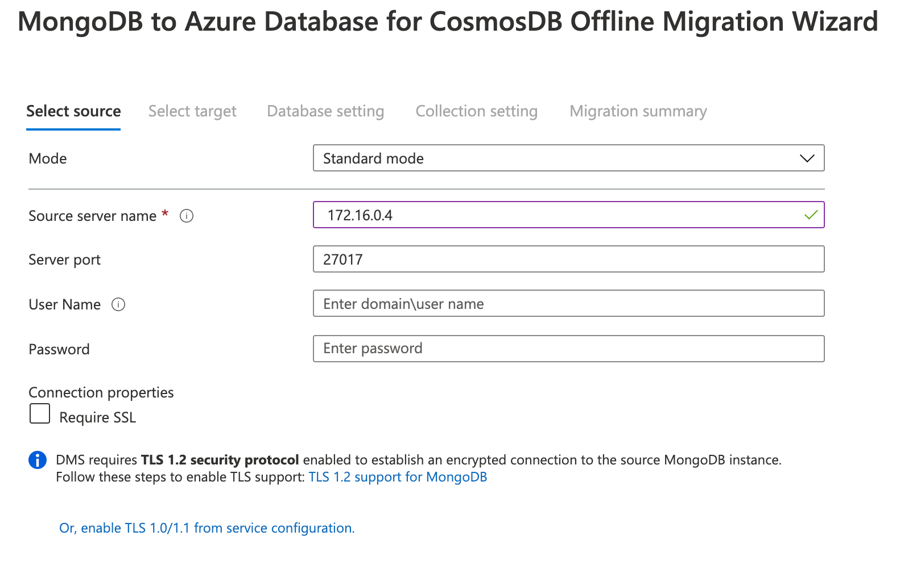
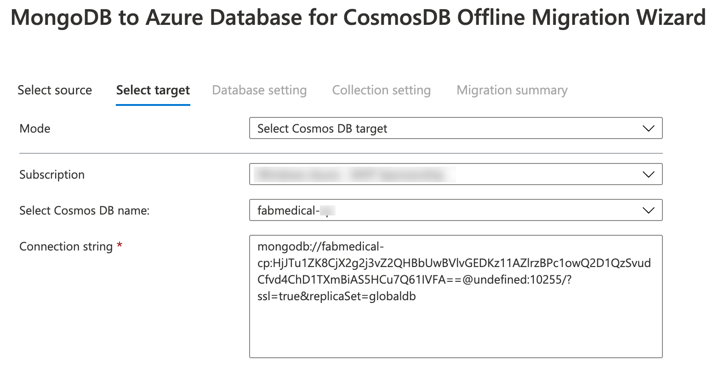

## Exercise 2: Migrate MongoDB to Cosmos DB using Azure Database Migration Service

**Duration**: 20 minutes

At this point, you have the web and API applications running in Azure Kubernetes Service. The next, step is to migrate the MongoDB database data over to Azure Cosmos DB. This exercise will use the Azure Database Migration Service to migrate the data from the MongoDB database into Azure Cosmos DB.

### Task 1: Enable Microsoft.DataMigration resource provider

In this task, you will enable the use of the Azure Database Migration Service within your Azure subscription by registering the `Microsoft.DataMigration` resource provider.

1. Open the Azure Cloud Shell.

2. Run the following Azure CLI command to register the `Microsoft.DataMigration` resource provider in your Azure subscription:

   ```sh
   az provider register --namespace Microsoft.DataMigration
   ```

### Task 2: Provision Azure Database Migration Service

In this task, you will deploy an instance of the Azure Database Migration Service that will be used to migrate the data from MongoDB to Cosmos DB.

1. From the Azure Portal, select **+ Create a resource**.

2. Search the marketplace for **Azure Database Migration Service** and select it.

3. Select **Create**.

    

4. On the **Basics** tab of the **Create Migration Service** pane, enter the following values:

    - Resource group: Select the Resource Group created with this lab.
    - Migration service name: Enter a name, such as `fabmedical[SUFFIX]`.
    - Location: Choose the Azure Region used for the Resource Group.

    

5. Select **Next: Networking >>**.

6. On the **Networking** tab, select the **Virtual Network** within the `fabmedical-[SUFFIX]` resource group.

    

7. Select **Review + create**.

8. Select **Create** to create the Azure Database Migration Service instance.

The service may take 5 - 10 minutes to provision.

### Task 3: Migrate data to Azure Cosmos DB

In this task, you will create a **Migration project** within Azure Database Migration Service, and then migrate the data from MongoDB to Azure Cosmos DB.

1. In the Azure Portal, navigate to the **Azure Database Migration Service** that was previously provisioned.

2. On the Azure Database Migration Service blade, select **+ New Migration Project** on the **Overview** pane.

3. On the **New migration project** pane, enter the following values, then select **Create and run activity**:

    - Project name: `fabmedical`
    - Source server type: `MongoDB`
    - Target server type: `CosmosDB (MongoDB API)`
    - Choose type of activity: `Offline data migration`

    

    > **Note:** The **Offline data migration** activity type is selected since you will be performing a one-time migration from MongoDB to Cosmos DB. Also, the data in the database won't be updated during the migration. In a production scenario, you will want to choose the migration project activity type that best fits your solution requirements.

4. On the **MongoDB to Azure Database for CosmosDB Offline Migration Wizard** pane, enter the following values for the **Select source** tab:

    - Mode: **Standard mode**
    - Source server name: Enter the Private IP Address of the Build Agent VM used in this lab.
    - Server port: `27017`
    - Require SSL: Unchecked

    > **Note:** Leave the **User Name** and **Password** blank as the MongoDB instance on the Build Agent VM for this lab does not have authentication turned on. The Azure Database Migration Service is connected to the same VNet as the Build Agent VM, so it's able to communicate within the VNet directly to the VM without exposing the MongoDB service to the Internet. In production scenarios, you should always have authentication enabled on MongoDB.

    

5. Select **Next: Select target >>**.

6. On the **Select target** pane, select the following values:

    - Mode: **Select Cosmos DB target**

    - Subscription: Select the Azure subscription you're using for this lab.

    - Select Cosmos DB name: Select the `fabmedical-[SUFFIX]` Cosmos DB instance.

    

    Notice, the **Connection String** will automatically populate with the Key for your Azure Cosmos DB instance.

7. Modify the **Connection string** by replacing `@undefined:` with `@fabmedical-[SUFFIX].documents.azure.com:` so the DNS name matches the Azure Cosmos DB instance. Be sure to replace the `[SUFFIX]`.

    

8. Select **Next: Database setting >>**.

9. On the **Database setting** tab, select the `contentdb` **Source Database** so this database from MongoDB will be migrated to Azure Cosmos DB.

    

10. Select **Next: Collection setting >>**.

11. On the **Collection setting** tab, expand the **contentdb** database, and ensure both the **sessions** and **speakers** collections are selected for migration. Also, update the **Throughput (RU/s)** to `400` for both collections.

    

12. Select **Next: Migration summary >>**.

13. On the **Migration summary** tab, enter `Migrate Data` in the **Activity name** field, then select **Start migration** to initiate the migration of the MongoDB data to Azure Cosmos DB.

    

14. The status for the migration activity will be shown. The migration will only take a few seconds to complete. Select **Refresh** to reload the status to ensure it shows a **Status** of **Complete**.

     

15. To verify the data was migrated, navigate to the **Cosmos DB Account** for the lab within the Azure Portal, then select the **Data Explorer**. You will see the `speakers` and `sessions` collections listed within the `contentdb` database, and you will be able to explore the documents within.

    

